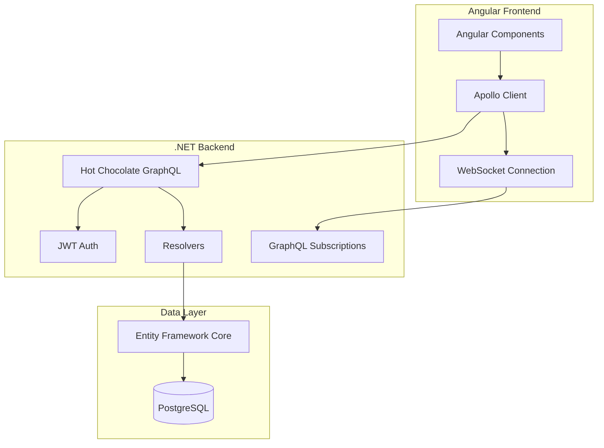
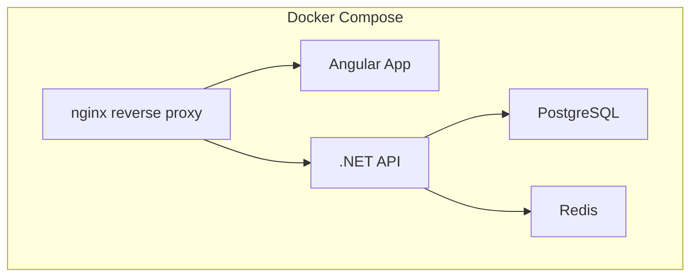

# Real-Time Chat App Architecture Plan

## Project Overview

A full-featured real-time chat application built with Angular, GraphQL, PostgreSQL, and Docker. This is a learning/demo project with the following core features:

- User authentication (email/username + password)
- Real-time messaging
- Private chat (1-on-1)
- Group chat (chat rooms)
- Online presence indicators

---

## Technology Stack

| Layer | Technology | Purpose |
|-------|------------|---------|
| Frontend | Angular 17+ | UI Framework |
| Frontend | Apollo Angular | GraphQL Client |
| Backend | .NET 8 | Runtime |
| Backend | Hot Chocolate | GraphQL API |
| Real-time | GraphQL Subscriptions | WebSocket-based real-time |
| Pub/Sub | Redis | Message broker for subscriptions |
| Database | PostgreSQL | Primary database |
| ORM | Entity Framework Core | Database access layer |
| Auth | JWT | Token-based authentication |
| Docker | Docker Compose | Container orchestration |

---

## System Architecture



---

## Docker Architecture



### Container Services

| Service | Image | Port | Description |
|---------|-------|------|-------------|
| `postgres` | postgres:15 | 5432 | Database |
| `redis` | redis:7-alpine | 6379 | Pub/Sub for GraphQL Subscriptions |
| `backend` | mcr.microsoft.com/dotnet/aspnet:8.0 | 5000 | GraphQL API |
| `frontend` | nginx:alpine | 80 | Angular SPA |
| `nginx` | nginx:alpine | 80→443 | Reverse proxy |

---

## Database Schema

### Users Table
| Column | Type | Constraints |
|--------|------|-------------|
| id | UUID | PRIMARY KEY |
| email | VARCHAR(255) | UNIQUE, NOT NULL |
| username | VARCHAR(50) | UNIQUE, NOT NULL |
| password | VARCHAR(255) | NOT NULL (hashed) |
| avatar | VARCHAR(255) | NULLABLE |
| createdAt | TIMESTAMP | DEFAULT NOW() |
| updatedAt | TIMESTAMP | |

### Conversations Table
| Column | Type | Constraints |
|--------|------|-------------|
| id | UUID | PRIMARY KEY |
| type | ENUM | 'PRIVATE', 'GROUP' |
| name | VARCHAR(100) | NULLABLE (for groups) |
| createdAt | TIMESTAMP | DEFAULT NOW() |
| updatedAt | TIMESTAMP | |

### ConversationMembers Table
| Column | Type | Constraints |
|--------|------|-------------|
| id | UUID | PRIMARY KEY |
| conversationId | UUID | FK → Conversations |
| userId | UUID | FK → Users |
| role | ENUM | 'MEMBER', 'ADMIN' |
| joinedAt | TIMESTAMP | DEFAULT NOW() |

### Messages Table
| Column | Type | Constraints |
|--------|------|-------------|
| id | UUID | PRIMARY KEY |
| conversationId | UUID | FK → Conversations |
| senderId | UUID | FK → Users |
| content | TEXT | NOT NULL |
| createdAt | TIMESTAMP | DEFAULT NOW() |

---

## GraphQL API Schema

### Types

```graphql
type User {
  id: ID!
  email: String!
  username: String!
  avatar: String
  createdAt: DateTime!
  conversations: [Conversation!]!
}

type Conversation {
  id: ID!
  type: ConversationType!
  name: String
  members: [User!]!
  messages(limit: Int): [Message!]!
  createdAt: DateTime!
}

type Message {
  id: ID!
  conversation: Conversation!
  sender: User!
  content: String!
  createdAt: DateTime!
}
```

### Queries

```graphql
type Query {
  # Auth
  me: User
  
  # Users
  users: [User!]!
  user(id: ID!): User
  
  # Conversations
  myConversations: [Conversation!]!
  conversation(id: ID!): Conversation
}
```

### Mutations

```graphql
type Mutation {
  # Auth
  register(input: RegisterInput!): AuthPayload!
  login(input: LoginInput!): AuthPayload!
  
  # Conversations
  createConversation(input: CreateConversationInput!): Conversation!
  joinConversation(id: ID!): Conversation!
  
  # Messages
  sendMessage(input: SendMessageInput!): Message!
}
```

### Subscriptions

```graphql
type Subscription {
  messageSent(conversationId: ID!): Message!
  userOnline(userId: ID!): User!
}
```

---

## Implementation Roadmap

### Phase 1: Project Setup
- [x] Initialize Angular project
- [x] Initialize .NET backend project
- [x] Set up Docker Compose configuration
- [x] Configure PostgreSQL container

### Phase 2: Backend Core
- [x] Set up Entity Framework Core with migrations
- [x] Implement user authentication (register/login)
- [x] Create GraphQL schema with Hot Chocolate
- [x] Implement JWT authentication middleware
- [x] Set up Redis PubSub for GraphQL Subscriptions

### Phase 3: Real-Time Features
- [x] Set up GraphQL Subscriptions with WebSocket
- [x] Implement message subscription
- [ ] Add online presence tracking

### Phase 4: Frontend Core
- [ ] Set up Angular with Apollo Client
- [ ] Create authentication pages (login/register)
- [ ] Implement conversation list component

### Phase 5: Chat Features
- [ ] Create chat room component
- [ ] Implement real-time message display
- [ ] Add private and group chat functionality

### Phase 6: Polish
- [ ] Add user avatars
- [ ] Style the UI
- [ ] Add loading states and error handling

---

## File Structure

```
chat-app/
├── docker-compose.yml
├── nginx/
│   └── nginx.conf
├── backend/
│   ├── ChatApp.Backend.csproj
│   ├── Program.cs
│   ├── appsettings.json
│   ├── .env
│   ├── Configuration/
│   │   └── AppConfig.cs
│   ├── Models/
│   │   ├── User.cs
│   │   ├── Conversation.cs
│   │   ├── Message.cs
│   │   └── ConversationMember.cs
│   ├── Data/
│   │   └── AppDbContext.cs
│   ├── GraphQL/
│   │   ├── Types/
│   │   │   ├── UserType.cs
│   │   │   ├── ConversationType.cs
│   │   │   ├── ConversationMemberType.cs
│   │   │   └── MessageType.cs
│   │   ├── Queries.cs
│   │   ├── Mutations.cs
│   │   └── Subscriptions.cs
│   ├── Services/
│   │   ├── JwtService.cs
│   │   └── RedisPubSubService.cs
│   └── Properties/
│       └── launchSettings.json
└── frontend/
    ├── src/
    │   ├── app/
    │   │   ├── components/
    │   │   ├── pages/
    │   │   ├── services/
    │   │   ├── graphql/
    │   │   └── app.component.ts
    │   ├── environments/
    │   └── main.ts
    ├── angular.json
    └── package.json
```

---

## Next Steps

1. **Approve this plan** - Confirm the architecture and features
2. **Start Phase 1** - Set up the project structure and Docker containers
3. **Proceed iteratively** - Build features step by step

Would you like me to proceed with implementing any specific phase, or would you like to make any changes to this plan?